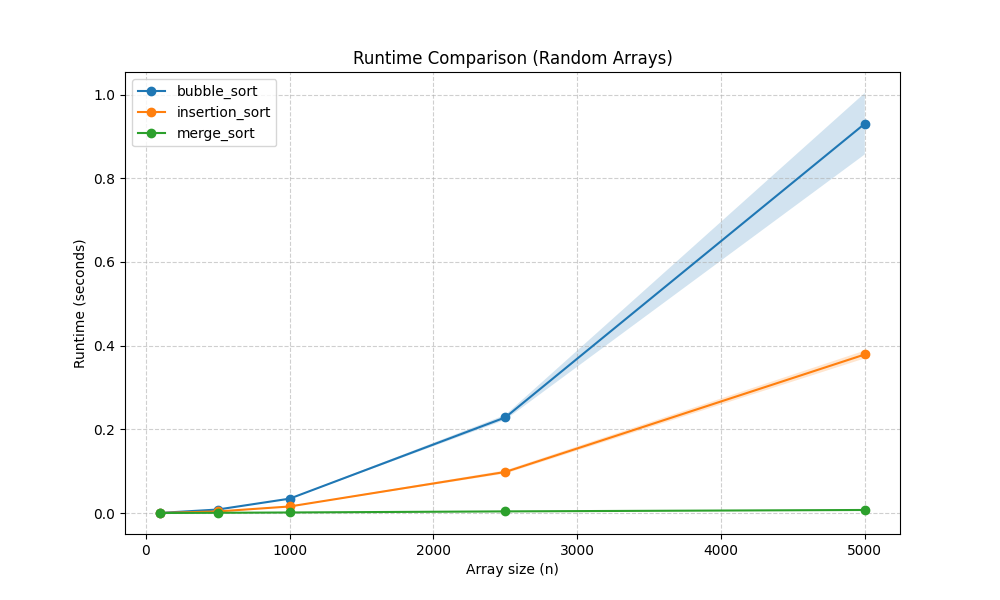
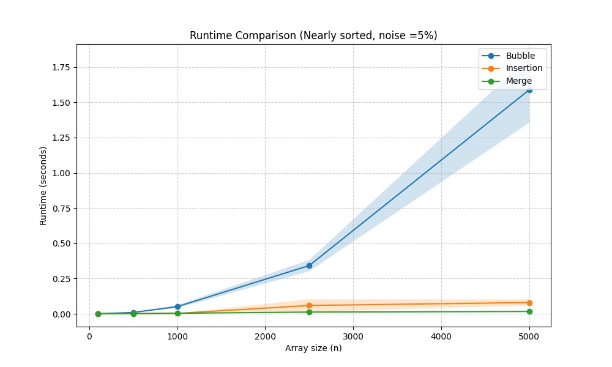

# Sorting_Assignment
Data Structures Python Assignment 1 
Student Names: Adi Naor and Yael Malki

The selected algorithms: Bubble Sort, Insertion Sort, Merge Sort.

 figure 1: 

"The results demonstrate a clear difference in how the three algorithms scale with larger datasets. As the array size grows, the runtimes for Bubble Sort and Insertion Sort increase rapidly. Although both are slower algorithms, Bubble Sort is significantly slower than Insertion Sort because it requires many more swaps, whereas Insertion Sort handles elements more efficiently. In contrast, Merge Sort remains extremely fast, with its runtime staying nearly flat even as the others become impractical. This gap proves that for large datasets, algorithmic design is far more important than hardware speed. While all three are functional for small arrays, Merge Sort is the only practical choice for scaling to thousands or millions of element

figure 2:

The results for the nearly sorted arrays show a major change in performance, especially for Insertion Sort. Since the array is mostly sorted, Insertion Sort only needs to make a few minor adjustments, allowing it to run almost as fast as Merge Sort. In contrast, Bubble Sort still performs poorly because it continues to scan through the entire array multiple times, even when most elements are already in place. Meanwhile, Merge Sort shows consistent performance regardless of the initial order, as its "divide and conquer" approach always performs the same amount of work. This experiment proves that while Merge Sort is generally the most reliable, Insertion Sort becomes highly efficient when dealing with data that is already close to being sorted.
